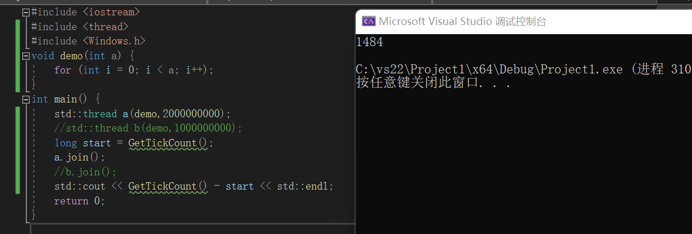
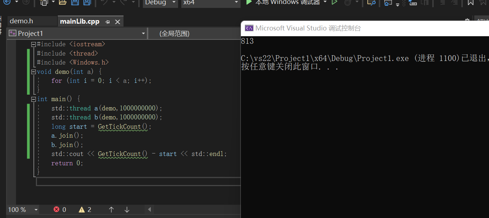

# C++多线程
+ 进程和线程
+ 并发
+ C++多线程的实现
+ 代码实现1
+ C++互斥锁
+ 代码实现2
+ 小demo
+ 总结

## 进程和线程

### 进程
进程是一个应用程序加载到内存后从开始执行到执行结束的过程。进程是程序的一次执行。进程通常由程序，数据和进程控制块(PCB)组成。打开应用程序就是开启了一个进程。

传统的进程可以获取操作系统分配的资源(内存)，也可以参与操作系统的调度，参与CPU的竞争，得到分配的时间片，获得CPU运行(引入线程后，线程负责参与操作系统的调度，进程本身不能得到时间片)。

进程的一系列如创建，撤销等操作，系统会付出较大的时间和空间消耗。

### 线程
线程是线程中的一个实体，是系统独立分配时间片和调度的基本单位，线程是CPU运行的最小单位。

线程的引入使得进程本身只负责获取操作系统分配的资源。进程负责参与操作系统的调度，获取时间片，让CPU运行。

线程本身只拥有运行时必要的一点资源。其他的资源都属于进程本身，线程和同一进程的其他线程共享进程所拥有的全部资源。

线程也可以称作“轻量型进程”,同一进程中的所有线程可以并发执行。

### notes

进程和线程都可以分为系统级和用户级。但不同的是用户级线程不需要系统调用实现，程序内部实现。而无论是用户进程还是系统进程都依赖于系统内核。

进程的一系列操作对于系统的开销非常大，在一个进程中创建多个线程，可以提高进程的并发程度。

### 小总结
在一个进程中同时执行多个小部分，这就是多线程。

## 并发

### 概念
在同一时间CPU同时执行两条或两条以上的指令，就是并发。

### 伪并发

伪并发是指CPU以极快的速度不停切换不同应用程序的命令，感觉像是在同时执行多个应用程序，这就是伪并发。

单核CPU不能实现真正的并发，只能时不同的线程占据不同的时间片，而CPU在线程中来回切换。

这样的运行在单核CPU中的多线程程序唯一的好处就是可以更好的利用CPU的空闲时间，但并没有起到提高程序运行速度的作用。

### 物理基础

真正的并发实现必须得到硬件的支持，也就是必须是多核CPU，然后才开始考虑语言的支持。

## C++多线程的实现

C++采用多线程来实现并发。

C++11中开始引入多线程，通过使用thread线程类对象来管理线程，只需要#include <thread>即可，创建一个thread对象标志着一个线程的开始。

thread构造函数
thread 对象名(线程函数名，参数1，···，参数n)
每一个线程有一个线程函数，线程函数中包括了该线程要做的事情。

一个进程至少有一个线程，C++中main函数就是那个必要的线程，称为主线程。如果有其他的子线程被创建，其是完成独立与主线程的，主线程并不知到CPU何时会调度他，他什么时候结束。

**join()**当线程类对象运行这个方法时，意味这主线程和子线程是同步关系，主线程要等待子线程执行完毕才会结束，join()是一个阻塞函数。

**detach()**主线程不用等待子线程执行完毕，两者无任何关系，等待主线程结束后，系统会结束进程，所有子线程结束（所以当主线程结束后，子线程即使任然在执行也会结束）。

C++标准线程函数只能返回void，所以线程一般采取引用传值的形式。

## 代码实现1
下面是c++多线程的代码实现
### 


用一个线程完成数据的遍历


用两个线程并行完成同样数量数据的遍历

## C++互斥锁

### 锁的概念

### 互斥锁的作用

## 代码实现2
```

```
## demo
```

```
## 总结
**为什么需要多线程**

1. 因为将一个任务分成多个小任务，同时执行，可以节省时间。
2. 当某一线程阻塞时(比如当主线程需要用户输入数据时),其他线程可以继续工作，不会使整个进程都停止工作。
